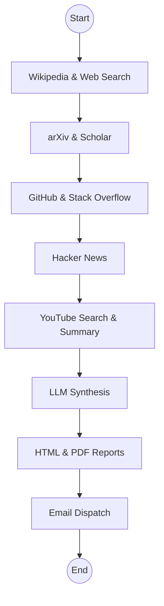

# Research-Agent 🔬

An autonomous research agent powered by LangChain and LangGraph that performs deep investigation into any topic using multiple sources and generates professional reports.

## 🌟 Key Features

*   **Multi-Source Research**: Investigations across Wikipedia, Google Search (Tavily), arXiv, Semantic Scholar, GitHub, Hacker News, and Stack Overflow.
*   **Robust Content Extraction**:
    *   **YouTube Fallback**: Automatically continues research using video metadata (titles/authors) if transcripts are blocked or unavailable.
    *   **GitHub Recall**: Intelligent search fallback that broadens the scope if specific language-filtered results are not found.
*   **Premium Web Dashboard**: A modern Streamlit interface with real-time progress tracking, auto-recovery of results, and embedded report viewing.
*   **Premium Reporting**:
    *   **Modern HTML Report**: High-end aesthetic with a clean, card-based mobile-responsive design and professional typography.
    *   **PDF Summary**: High-quality PDF focused on the Executive Summary for professional sharing.
*   **AI Synthesis**: Uses advanced LLMs (Ollama-based Qwen 2.5/Gemma) to consolidate findings into a technical Executive Summary.
*   **Email Delivery**: Automatically sends the generated reports (HTML + PDF) to your email via SMTP.

## 🛠 Architecture

The agent follows an autonomous graph-based workflow using **LangGraph**:



## 🚀 Deployment & Running Options

### Option 1: Docker Compose (Recommended)
The easiest way to run the dashboard and agent without managing Python dependencies.

**1. Launch the Dashboard (Web UI):**
```bash
docker compose up -d
```
Access the UI at: **http://localhost:8501**

**2. Run the CLI version via Docker:**
```bash
docker compose run --rm research-agent python src/main.py "Your Topic"
```

---

### Option 3: Running Tests
Verify the agent's functionality with the built-in testing suite.

```bash
export PYTHONPATH=$PYTHONPATH:$(pwd)/src
pytest tests/
```

## ⚙️ Configuration
For developers who want to run or modify the agent directly.

**1. Setup Environment:**
```bash
python -m venv .venv
source .venv/bin/activate
pip install -r requirements.txt
```

**2. Run the Web Dashboard:**
```bash
streamlit run src/app.py
```

**3. Run the CLI Version:**
```bash
python src/main.py "Your Topic"
```

## ⚙️ Configuration

Copy `env.example` to `.env` and configure your credentials:

| Variable | Description |
| :--- | :--- |
| `TAVILY_API_KEY` | API Key for web searches. |
| `GITHUB_TOKEN` | (Optional) For higher rate limits on GitHub search. |
| `OLLAMA_BASE_URL` | URL of your Ollama instance (default: http://localhost:11434). |
| `EMAIL_USERNAME` | SMTP email for sending reports. |
| `EMAIL_PASSWORD` | App-specific password for the email account. |
| `EMAIL_RECIPIENT` | Default recipient for the research reports. |

## 📦 Requirements

*   **Python 3.10+** (if running locally)
*   **Ollama**: Pull the model `qwen2.5:14b` before running.
*   **Docker & Docker Compose** (optional but recommended).

## 📄 License

This project is licensed under the MIT License - see the [LICENSE](LICENSE) file for details.
