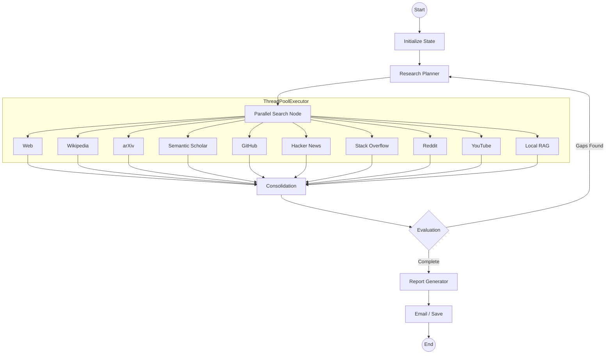

# Research-Agent

Autonomous research agent powered by LangGraph that investigates any topic using 10+ sources, customizable personas, and local document integration (RAG). All sources execute in parallel for fast results.

## Features

- **Parallel Multi-Source Research**: Web, Wikipedia, arXiv, Semantic Scholar, GitHub, Hacker News, Stack Overflow, Reddit, YouTube, and local RAG — all execute concurrently via `ThreadPoolExecutor`.
- **Research Personas**: Product Manager, Software Architect, Market Analyst, Scientific Reviewer, or Generalist — each shapes source selection and analysis style.
- **Local Knowledge (RAG)**: Upload PDFs/TXT files through the dashboard or place them in `./knowledge_base`. Indexed with SQLite cache and ChromaDB vector search.
- **Self-Correction Loop**: Evaluation node detects information gaps and triggers re-planning automatically (max 2 iterations).
- **Export Center**: One-click reports in PDF, Word, Markdown, and HTML, saved to `./reports/`.
- **Configurable Depth**: Quick (2 results/source), Standard (5), or Deep (10).
- **Multilingual**: Auto-expands queries to English for global academic/technical coverage.

## Architecture



Flow: `initialize_state` → `plan_research` → `parallel_search` → `consolidate_research` → `evaluate_research` → `generate_report` → `send_email` → `save_db`

## Quick Start

### Docker Compose (Recommended)
```bash
cp env.example .env   # Configure API keys
docker compose up -d
```
Access the UI at **http://localhost:8501**

> The container runs as a non-root user with resource limits (`512m` memory, `1 CPU`) and a health check. Volumes mount `./reports`, `./data`, and `./knowledge_base`.

### Local Installation
```bash
python -m venv .venv && source .venv/bin/activate
pip install -r requirements.txt
streamlit run src/app.py --server.address=0.0.0.0
```

## Configuration

| Variable | Description | Default |
| :--- | :--- | :--- |
| `OLLAMA_MODEL` | LLM model | `qwen3:14b` |
| `OLLAMA_BASE_URL` | Ollama endpoint | `http://localhost:11434` |
| `TAVILY_API_KEY` | Web search (Tavily) | Required |
| `GITHUB_TOKEN` | GitHub API access | Optional |
| `EMAIL_USERNAME` | Report delivery | Optional |

See `env.example` for the full list.

## Testing

```bash
# Inside Docker
docker compose run --rm research-agent python -m pytest tests/ -v

# Local
pytest tests/ -v
```

49 tests covering agent workflow, all research tools, RAG, report generation, persistence, security validation, resilience, and load.

## Documentation

| Document | Description |
| :--- | :--- |
| [Architecture](docs/ARCHITECTURE.md) | System design, workflow, and extension points |
| [Testing](docs/TESTING.md) | Test guide, fixtures, and CI setup |
| [Security](docs/SECURITY.md) | Input validation, credentials, deployment |
| [Developer Reference](docs/DEVELOPER_REFERENCE.md) | Internal modules, state, and configuration |
| [Deployment](docs/DEPLOYMENT.md) | Docker and production setup |
| [Troubleshooting](docs/TROUBLESHOOTING.md) | Common issues |
| [Changelog](CHANGELOG.md) | Version history |

## License

MIT — see [LICENSE](LICENSE).
