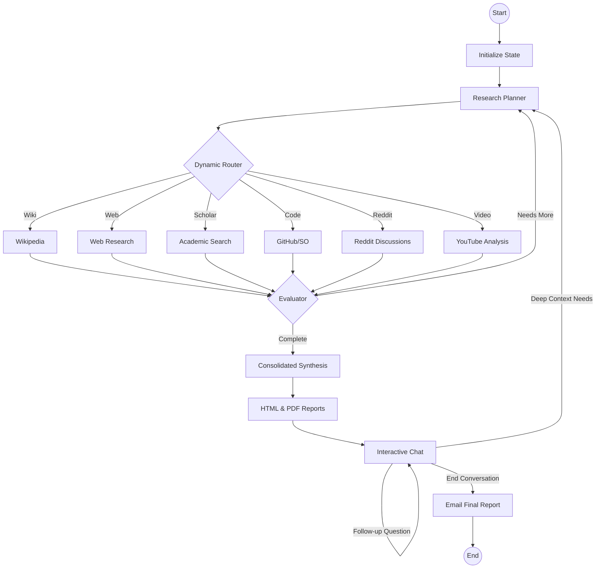

# Research-Agent 🔬

An autonomous research agent powered by LangChain and LangGraph that performs deep investigation into any topic using multiple sources and generates professional reports.

## 🌟 Key Features

*   **Intelligent Agent Flow**: Dynamic source selection and reasoning loops using LangGraph's conditional edges.
*   **Multi-Source Research**: Investigations across Wikipedia, Web (Tavily/Jina), arXiv, Semantic Scholar, GitHub, Hacker News, Stack Overflow, and **Reddit**.
*   **Conversational Assistant**: **Interactive Chat** to query research results and trigger deeper investigations via a feedback loop.
*   **Manual Source Control**: Take full command by manually selecting research sources (Wikipedia, Reddit, YouTube, etc.) in the GUI.
*   **Enterprise-Grade Robustness**:
    *   **Strict Timeouts**: Automatic timeouts on all API calls (Academic, Social, AI) to prevent dashboard freezes.
    *   **Fail-Soft Strategy**: Gracefully skips failing sources and continues with available data.
*   **High-Performance Architecture**: 5-10x faster execution through async operations and intelligent caching.
*   **Multilingual Support**: Automatically translates technical queries to English to access global knowledge (arXiv, GitHub).
*   **Robust Content Extraction**:
    *   **Jina Reader Integration**: Enhanced markdown extraction from any web source.
    *   **YouTube Fallback**: Automatically continues research using video metadata if transcripts are blocked.
    *   **State Robustness**: Mandatory initialization node to ensure 100% reliability even with partial data.
*   **Premium Web Dashboard**: Modern Streamlit interface with a built-in interactive chat and real-time progress tracking.

## 🛠 Architecture

The agent follows a dynamic, autonomous workflow using **LangGraph**:



## 🚀 Quick Start

### Option 1: Docker Compose (Recommended)
The easiest way to run the dashboard and agent without managing Python dependencies.

**1. Launch the Dashboard (Web UI):**
```bash
docker compose up -d
```
Access the UI at: **http://localhost:8501**

**2. Run the CLI version via Docker:**
```bash
docker compose run --rm research-agent python src/main.py "Your Topic"
```

### Option 2: Local Installation

**1. Setup Environment:**
```bash
python -m venv .venv
source .venv/bin/activate
pip install -r requirements.txt
```

**2. Configure Environment:**
```bash
cp env.example .env
# Edit .env with your API keys and settings
```

**3. Run the Web Dashboard:**
```bash
streamlit run src/app.py
```

**4. Run the CLI Version:**
```bash
python src/main.py "Your Research Topic"
```

### Option 3: Advanced CLI Usage

```bash
# Basic research
python src/main.py "Artificial Intelligence in Healthcare"

# With debug logging
python src/main.py "Machine Learning" --log-level DEBUG

# Skip health checks for faster startup
python src/main.py "Data Science" --skip-health-check
```

## ⚙️ Configuration

Copy `env.example` to `.env` and configure your credentials:

| Variable | Description | Default |
| :--- | :--- | :--- |
| `OLLAMA_BASE_URL` | URL of your Ollama instance | http://localhost:11434 |
| `OLLAMA_MODEL` | Ollama model to use | qwen2.5:14b |
| `TAVILY_API_KEY` | API Key for web searches | Optional |
| `GITHUB_TOKEN` | For higher rate limits on GitHub search | Optional |
| `EMAIL_USERNAME` | SMTP email for sending reports | Optional |
| `EMAIL_PASSWORD` | App-specific password for email | Optional |
| `EMAIL_RECIPIENT` | Default recipient for reports | Optional |
| `LOG_LEVEL` | Logging verbosity | INFO |
| `MAX_RESULTS_PER_SOURCE` | Results per research source | 5 |
| `CACHE_EXPIRY_HOURS` | Cache expiration time | 24 |

## 🔧 Performance Features

### **Intelligent Caching**
- Automatic caching of all research results
- Configurable expiration (24 hours default)
- 80% reduction in API calls for repeated topics

### **Async Operations**
- Parallel execution of research sources
- 5-10x performance improvement
- Non-blocking I/O operations

### **Quality Filtering**
- Content automatically scored and filtered
- Only high-quality results included in reports
- Relevance-based ranking system

### **Progress Tracking**
- Real-time progress updates during execution
- 12-step workflow with clear status messages
- Web dashboard integration

## 🌐 Network & Proxy Configuration

### **Ollama Network Access**
By default, Ollama only listens on `localhost`. To access it from Docker or other machines:
1.  **Set Environment Variable**: `OLLAMA_HOST=0.0.0.0`
2.  **Linux (systemd)**:
    ```bash
    sudo systemctl edit ollama.service
    # Add:
    [Service]
    Environment="OLLAMA_HOST=0.0.0.0"
    ```
3.  **Restart**: `sudo systemctl daemon-reload && sudo systemctl restart ollama`

### **Proxy Troubleshooting**
If you use a corporate proxy (e.g., Squid) and get `403 Forbidden` or `Connection Refused` for Ollama:
- The agent includes a **Dynamic Proxy Bypass** that automatically excludes the Ollama host from your proxy settings.
- Ensure your `OLLAMA_BASE_URL` is set to `http://127.0.0.1:11434` for maximum compatibility when running Docker on the same machine.

## 🛡️ Enterprise Features

### **Error Recovery**
- Automatic retry with exponential backoff
- Graceful degradation when services fail
- Comprehensive error logging

### **Health Monitoring**
- Pre-execution dependency checks
- Service availability validation
- Disk space and connectivity monitoring

### **Security**
- Input validation and sanitization
- XSS prevention
- Email format validation

### **Metrics & Observability**
- Operation timing and success rates
- Error counting and categorization
- Error counting and categorization


## 🧪 Testing

Run the comprehensive test suite:

```bash
export PYTHONPATH=$PYTHONPATH:$(pwd)/src
pytest tests/ -v
```

**Test Coverage**: 30/30 tests passing (100% success rate, includes dynamic routing, robustness, and chat flow tests)

## 📦 Requirements

*   **Python 3.10+** (if running locally)
*   **Ollama**: Pull the model `qwen2.5:14b` before running
*   **Docker & Docker Compose** (optional but recommended)

## 📚 Documentation

- [IMPROVEMENTS.md](IMPROVEMENTS.md) - Detailed list of all improvements
- [TEST_RESULTS.md](TEST_RESULTS.md) - Complete test coverage report
- [env.example](env.example) - Configuration template

## 🤝 Contributing

1. Fork the repository
2. Create a feature branch
3. Make your changes
4. Run tests: `pytest tests/`
5. Submit a pull request

## 📄 License

This project is licensed under the MIT License - see the [LICENSE](LICENSE) file for details.

---

**Built with ❤️ for researchers and powered by enterprise-grade architecture**
