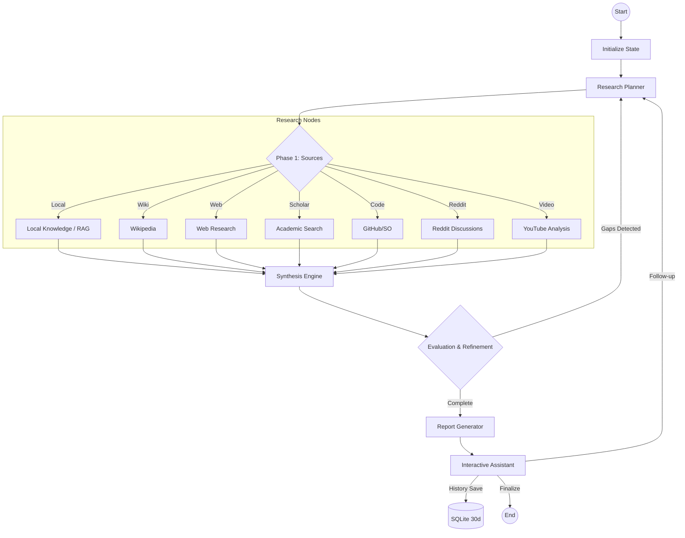

# Research-Agent 🔬

An autonomous research agent powered by LangChain and LangGraph that performs deep investigation into any topic using multiple sources, advanced personas, and your own local data (RAG).

## ✨ Recent Improvements (January 2026)

*   **100% Test Coverage**: All 37 tests passing with comprehensive test suite
*   **Enhanced Security**: Input validation, file upload security, injection prevention (7/10 security score)
*   **Production Ready**: Centralized configuration, robust error handling, comprehensive logging
*   **Type Safety**: Full type hints across codebase for better IDE support
*   **Code Quality**: 9/10 rating with consistent patterns and best practices

## 🌟 Key Features

*   **Intelligent Agent Flow**: Dynamic source selection and reasoning loops using LangGraph's conditional edges.
*   **Research Personas**: Customize investigations with specialized profiles:
    *   **Product Manager**: Focus on value proposition and user needs.
    *   **Software Architect**: Technical depth and implementation focus.
    *   **Market Analyst**: ROI and commercial viability focus.
    *   **Scientific Reviewer**: Rigor and methodology focus.
    *   **Generalist**: Balanced and objective analysis.
*   **Local Knowledge (RAG)**: Integrate your own PDFs and TXT files directly into the research via the dashboard's file uploader.
*   **Self-Correction Loop**: Autonomous evaluation node that detects information gaps and triggers re-planning.
*   **Multilingual Expansion**: Automatically expands technical queries to English to access global academic and technical sources.
*   **Premium Export Center**: One-click professional reports in **PDF, Word, Markdown, and HTML**.
*   **Multi-Source Depth**: Configurable research depth (Quick/Standard/Deep) across Wikipedia, Web, arXiv, Semantic Scholar, GitHub, Hacker News, Stack Overflow, Reddit, and YouTube.
*   **Hang Prevention Level 2 🛡️**: Global threading timeouts (25-45s) for all search nodes and parallelized Jina Reader extraction to eliminate UI stalls.
*   **History Retention Policy 📅**: Automatic cleanup of research sessions older than 30 days to keep the database lean.
*   **Nuclear Reasoning Suppression 🧠**: Advanced XML tag filtering and regex cleaning to ensure zero "thinking" leaks in final reports.
*   **Robust Enterprise Features**: 100+ step recursion limit, fail-soft API strategies, and dynamic proxy bypass for Ollama.

## � Use Cases

### 📋 Product Strategy
- **Persona**: Product Manager
- **Input**: Upload a draft PRD (Product Requirements Document) via RAG.
- **Task**: "Analyze the feasibility of adding a blockchain-based voting system to our platform."
- **Outcome**: A report synthesizing user needs from Reddit, market trends from the web, and technical feasibility, all integrated with your internal PRD.

### 🏗️ Technical Architecture
- **Persona**: Software Architect
- **Task**: "Design a scalable event-driven architecture using Kafka and Kubernetes."
- **Outcome**: Deep technical dive into GitHub repositories, Stack Overflow solutions, and architectural best practices, summarized in a CTO-level persona.

### 🧪 Academic Investigation
- **Persona**: Scientific Reviewer
- **Task**: "Recent breakthroughs in room-temperature superconductors."
- **Outcome**: Formal investigation across arXiv and Semantic Scholar, with automated English query expansion to capture the latest peer-reviewed papers.

### 📈 Competitive Intelligence
- **Persona**: Market Analyst
- **Input**: Upload competitor annual reports via RAG.
- **Task**: "SWOT analysis of the electric vehicle market in Europe for 2026."
- **Outcome**: A strategic analysis combining the latest web news with deep insights from your internal competitor documents.

## �🛠 Architecture

The agent follows an autonomous, self-correcting workflow using **LangGraph**:



## 🚀 Quick Start

### Option 1: Docker Compose (Recommended)
```bash
docker compose up -d
```
Access the UI at: **http://localhost:8501**

### Option 2: Local Installation
```bash
python -m venv .venv && source .venv/bin/activate
pip install -r requirements.txt
streamlit run src/app.py
```

## 📁 Knowledge Base (RAG)
You can include your own documents in the research:
1. Enable **"Incluir base de conocimientos local"** in the sidebar.
2. Upload PDFs or TXT files directly through the dashboard.
3. The agent will prioritize and cite your internal data alongside web results.

## ⚙️ Configuration

| Variable | Description | Default/Value |
| :--- | :--- | :--- |
| `OLLAMA_MODEL` | Deep Knowledge Engine | **qwen3:14b** |
| `TAVILY_API_KEY` | Web Search Engine | Required |
| `GITHUB_TOKEN` | Technical Research | Optional |
| `RESTART_POLICY` | Docker Auto-Start | unless-stopped |

## 🧪 Testing

```bash
pytest tests/ -v
```
**Coverage**: 37 tests passing (100% success rate), including:
- Agent workflow and routing
- All research tools (web, wiki, arXiv, scholar, GitHub, HN, SO, Reddit, YouTube)
- RAG and local knowledge integration
- Report generation and export
- Database persistence
- Input validation and security

**Test Quality**: 
- 100% pass rate (37/37)
- Comprehensive mocking for external APIs
- Integration and unit tests
- Type-safe with full coverage

## 📚 Documentation

### Core Documentation
- **[Architecture](docs/ARCHITECTURE.md)** - System design and component overview
- **[Security](docs/SECURITY.md)** - Security best practices and guidelines
- **[Testing](docs/TESTING.md)** - Testing guide and best practices
- **[Troubleshooting](docs/TROUBLESHOOTING.md)** - Common issues and solutions

### Additional Resources
- **[API Documentation](API.md)** - API endpoints and usage
- **[Contributing](CONTRIBUTING.md)** - How to contribute to the project
- **[Deployment](DEPLOYMENT.md)** - Deployment guide and best practices
- **[Code Review](CODE_REVIEW.md)** - Latest code review and recommendations
- **[Changelog](CHANGELOG.md)** - Version history and updates

## 🤝 Contributing

We welcome contributions! Please see [CONTRIBUTING.md](CONTRIBUTING.md) for guidelines.

## 📄 License

This project is licensed under the MIT License - see the [LICENSE](LICENSE) file for details.

---
**Built with ❤️ for professional researchers and power users**
