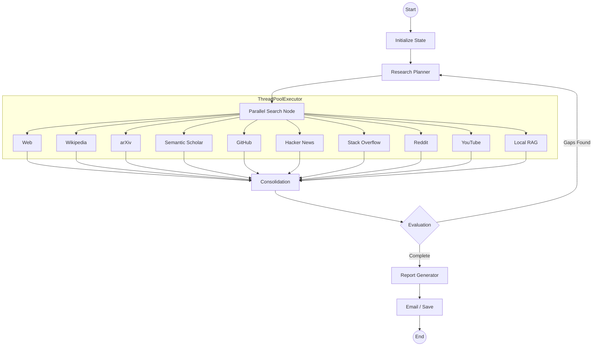

# Research-Agent

[](https://www.python.org/downloads/)
[](LICENSE)
[]()

LangGraph-based autonomous research agent with 5 personas, searching 10 sources in parallel (Tavily, arXiv, Wikipedia, Semantic Scholar, GitHub, etc.). Multi-source RAG via ChromaDB, iterative re-planning, PDF/Word/Markdown export. Streamlit UI.

## Features

- **Parallel Multi-Source Research**: Web, Wikipedia, arXiv, Semantic Scholar, GitHub, Hacker News, Stack Overflow, Reddit, YouTube, and local RAG -- all execute concurrently via `ThreadPoolExecutor`.
- **Research Personas**: Product Manager, Software Architect, Market Analyst, Scientific Reviewer, or Generalist -- each shapes source selection and analysis style.
- **Local Knowledge (RAG)**: Upload PDFs/TXT files through the dashboard or place them in `./knowledge_base`. Indexed with SQLite cache and ChromaDB vector search.
- **Self-Correction Loop**: Evaluation node detects information gaps and triggers re-planning automatically (max 2 iterations).
- **Export Center**: One-click reports in PDF, Word, Markdown, and HTML, saved to `./reports/`.
- **Configurable Depth**: Quick (2 results/source), Standard (5), or Deep (10).
- **Multilingual**: Auto-expands queries to English for global academic/technical coverage.

## Architecture


```mermaid
graph TD
    Start((Start)) --> Init[Initialize State]
    Init --> Plan[Research Planner]
    Plan --> Parallel[Parallel Search Node]

    subgraph ThreadPoolExecutor
        Parallel --> Web[Web]
        Parallel --> Wiki[Wikipedia]
        Parallel --> Arxiv[arXiv]
        Parallel --> Scholar[Semantic Scholar]
        Parallel --> GH[GitHub]
        Parallel --> HN[Hacker News]
        Parallel --> SO[Stack Overflow]
        Parallel --> Reddit[Reddit]
        Parallel --> YT[YouTube]
        Parallel --> RAG[Local RAG]
    end

    Web & Wiki & Arxiv & Scholar & GH & HN & SO & Reddit & YT & RAG --> Synth[Consolidation]
    Synth --> Eval{Evaluation}

    Eval -->|Gaps Found| Plan
    Eval -->|Complete| Report[Report Generator]
    Report --> Email[Email / Save]
    Email --> End((End))
```

Flow: `initialize_state` -> `plan_research` -> `parallel_search` -> `consolidate_research` -> `evaluate_research` -> `generate_report` -> `send_email` -> `save_db`

## Quick Start

### Docker Compose (Recommended)
```bash
git clone https://github.com/RobertoDeLaCamara/Research-Agent.git
cd Research-Agent
cp env.example .env   # Configure API keys
docker compose up -d
```
Access the UI at **http://localhost:8501**

> The container runs as a non-root user with resource limits (`512m` memory, `1 CPU`) and a health check. Volumes mount `./reports`, `./data`, and `./knowledge_base`.

### Local Installation
```bash
python -m venv .venv && source .venv/bin/activate
pip install -r requirements.txt
streamlit run src/app.py --server.address=0.0.0.0
```

## Project Structure

```
Research-Agent/
├── src/
│   ├── app.py                  # Streamlit UI entry point
│   ├── graph.py                # LangGraph workflow definition
│   ├── state.py                # AgentState schema
│   ├── config.py               # Settings (Pydantic v2)
│   ├── validators.py           # Input validation
│   ├── nodes/                  # Graph nodes (plan, search, consolidate, evaluate, report)
│   ├── tools/
│   │   ├── parallel_tools.py   # ThreadPoolExecutor parallel search
│   │   ├── research_tools.py   # Web, arXiv, Semantic Scholar, HN, SO
│   │   ├── reddit_tools.py     # Reddit search
│   │   ├── youtube_tools.py    # YouTube transcript search
│   │   └── rag_tools.py        # ChromaDB local knowledge RAG
│   └── report/                 # PDF, Word, Markdown, HTML generators
├── knowledge_base/             # User-uploaded documents (PDF/TXT)
├── reports/                    # Generated research reports
├── data/                       # Persistent data (SQLite, ChromaDB)
├── tests/                      # 49 tests (agent, tools, RAG, security, resilience, load)
├── docs/                       # Architecture, Testing, Security, Deployment, Troubleshooting
├── docker-compose.yml          # With resource limits and health check
├── Jenkinsfile                 # CI pipeline (build, test, push to registry)
├── env.example                 # API key template
└── requirements.txt
```

## Configuration

| Variable | Description | Default |
| :--- | :--- | :--- |
| `OLLAMA_MODEL` | LLM model | `qwen3:14b` |
| `OLLAMA_BASE_URL` | Ollama endpoint | `http://localhost:11434` |
| `TAVILY_API_KEY` | Web search (Tavily) | Required |
| `GITHUB_TOKEN` | GitHub API access | Optional |
| `EMAIL_USERNAME` | Report delivery (SMTP) | Optional |
| `EMAIL_PASSWORD` | SMTP password | Optional |
| `OPENAI_API_KEY` | OpenAI backend (alternative to Ollama) | Optional |

See `env.example` for the full list.

## Testing

```bash
# Inside Docker
docker compose run --rm research-agent python -m pytest tests/ -v

# Local
pytest tests/ -v
```

49 tests covering agent workflow, all research tools, RAG, report generation, persistence, security validation, resilience, and load.

## CI/CD

Jenkins multibranch pipeline (Gitea SCM source) with automatic webhook trigger:
- **Build** Docker image
- **Test** inside container
- **Push** to private Docker registry (`192.168.1.86:5000/research-agent`)

## Documentation

| Document | Description |
| :--- | :--- |
| [Architecture](docs/ARCHITECTURE.md) | System design, workflow, and extension points |
| [Testing](docs/TESTING.md) | Test guide, fixtures, and CI setup |
| [Security](docs/SECURITY.md) | Input validation, credentials, deployment |
| [Developer Reference](docs/DEVELOPER_REFERENCE.md) | Internal modules, state, and configuration |
| [Deployment](docs/DEPLOYMENT.md) | Docker and production setup |
| [Troubleshooting](docs/TROUBLESHOOTING.md) | Common issues |
| [Changelog](CHANGELOG.md) | Version history |

## License

MIT -- see [LICENSE](LICENSE).
