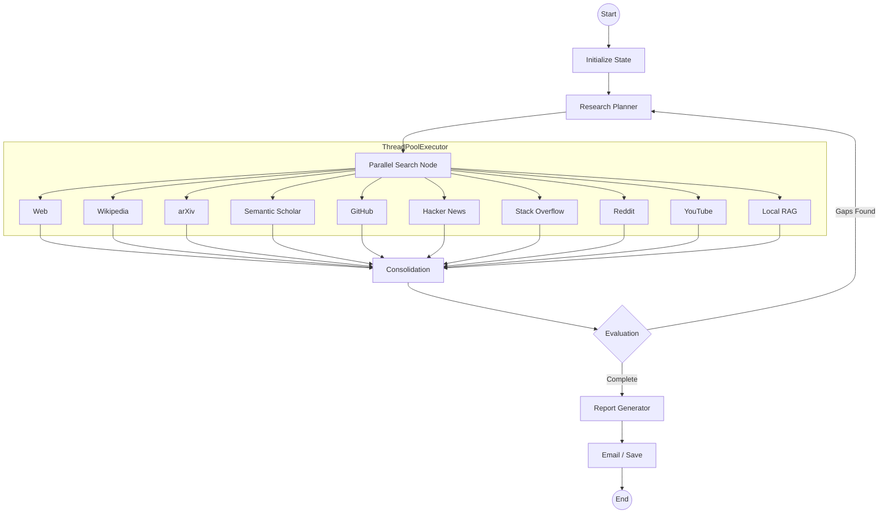

# Research-Agent

[](https://github.com/RobertoDeLaCamara/Research-Agent/actions/workflows/ci.yml)
[](https://www.python.org/downloads/)
[](LICENSE)
[](https://github.com/RobertoDeLaCamara/Research-Agent/stargazers)

Give it a topic. Get a sourced, structured research report in minutes.


Research-Agent is a LangGraph-based autonomous agent that searches **10 sources in parallel** (Tavily, arXiv, Wikipedia, Semantic Scholar, GitHub, Hacker News, Stack Overflow, Reddit, YouTube, local RAG), detects knowledge gaps and re-plans automatically, then exports a cited report in PDF, Word, Markdown, or HTML — all through a Streamlit UI backed by a local Ollama LLM.

## Features

- **Parallel Multi-Source Research**: Web, Wikipedia, arXiv, Semantic Scholar, GitHub, Hacker News, Stack Overflow, Reddit, YouTube, and local RAG -- all execute concurrently via `ThreadPoolExecutor`.
- **Research Personas**: Product Manager, Software Architect, Market Analyst, Scientific Reviewer, or Generalist -- each shapes source selection and analysis style.
- **Local Knowledge (RAG)**: Upload PDFs/TXT files through the dashboard or place them in `./knowledge_base`. Indexed with SQLite cache and ChromaDB vector search.
- **Self-Correction Loop**: Evaluation node detects information gaps and triggers re-planning automatically (max 2 iterations).
- **Export Center**: One-click reports in PDF, Word, Markdown, and HTML, saved to `./reports/`.
- **Configurable Depth**: Quick (2 results/source), Standard (5), or Deep (10).
- **Multilingual**: Auto-expands queries to English for global academic/technical coverage.

## Architecture


```mermaid
graph TD
    Start((Start)) --> Init[Initialize State]
    Init --> Plan[Research Planner]
    Plan --> Parallel[Parallel Search Node]

    subgraph ThreadPoolExecutor
        Parallel --> Web[Web]
        Parallel --> Wiki[Wikipedia]
        Parallel --> Arxiv[arXiv]
        Parallel --> Scholar[Semantic Scholar]
        Parallel --> GH[GitHub]
        Parallel --> HN[Hacker News]
        Parallel --> SO[Stack Overflow]
        Parallel --> Reddit[Reddit]
        Parallel --> YT[YouTube]
        Parallel --> RAG[Local RAG]
    end

    Web & Wiki & Arxiv & Scholar & GH & HN & SO & Reddit & YT & RAG --> Synth[Consolidation]
    Synth --> Eval{Evaluation}

    Eval -->|Gaps Found| Plan
    Eval -->|Complete| Report[Report Generator]
    Report --> Email[Email / Save]
    Email --> End((End))
```

Flow: `initialize_state` -> `plan_research` -> `parallel_search` -> `consolidate_research` -> `evaluate_research` -> `generate_report` -> `send_email` -> `save_db`

## Sample Output

> Research topic: *"Graph neural networks emerging use cases"* — Standard depth, Scientific Reviewer persona

---

**Industry Applications and Success Stories**

Graph Neural Networks (GNNs) are rapidly gaining traction in industries that rely on complex, interconnected data. A notable example is **Google Maps**, which leverages GNNs to improve arrival time predictions by analysing traffic patterns, road networks, and real-time events. In **healthcare**, GNNs are used for drug discovery — molecular structures represented as graphs to predict compound-protein interactions. In **finance**, GNNs detect fraud by analysing transaction networks for anomalous patterns.

**Technical Challenges and Scalability**

Sparse computations pose challenges for hardware optimisation, as traditional GPUs are not designed for irregular data structures. Recent research proposes three strategies: CPU-GPU hybrid training, graph-augmented MLPs for real-time inference, and quantisation-aware training to reduce computational cost.

**Integration with Knowledge Graphs and LLMs**

LLMs can automate KG creation by extracting relationships from unstructured text, which are then fed into GNNs for downstream tasks like recommendation systems or semantic search — particularly valuable in supply chain optimisation.

*[Full report: 1,200 words · 12 cited sources · exported as PDF, Word, Markdown]*

---

## Quick Start

### Zero-config (batteries included)

No Ollama, no API keys, no `.env` file needed. Docker only.

```bash
git clone https://github.com/RobertoDeLaCamara/Research-Agent.git
cd Research-Agent
docker compose -f docker-compose.full.yml up
```

Open **http://localhost:8501**. The first run pulls a ~1 GB model and may take a few minutes — subsequent starts are instant.

> **Want a guided setup instead?** Run `bash scripts/quickstart.sh` — it asks which LLM backend and model size you want, optionally adds API keys, then launches everything.

---

### Option B — Bring your own Ollama

If you already have [Ollama](https://ollama.com) running locally:

```bash
ollama pull qwen2.5:1.5b   # or any model you prefer
cp env.example .env         # defaults work out of the box
docker compose up -d
```

### Option C — Use OpenAI (or any compatible API)

```bash
cp env.example .env
# Edit .env: set OPENAI_API_KEY and point OLLAMA_BASE_URL to https://api.openai.com/v1
docker compose up -d
```

Works with any OpenAI-compatible endpoint: LM Studio, Together AI, Groq, Ollama, etc.

> **No API keys required for web search** — the agent falls back to DuckDuckGo automatically. Add a free [Tavily](https://tavily.com) key (`TAVILY_API_KEY`) for better results.

### Local Installation (no Docker)
```bash
python -m venv .venv && source .venv/bin/activate
pip install -r requirements.txt
cp env.example .env   # edit OLLAMA_BASE_URL if Ollama is not on localhost
streamlit run src/app.py
```

## Project Structure

```
Research-Agent/
├── src/
│   ├── app.py                  # Streamlit UI entry point
│   ├── graph.py                # LangGraph workflow definition
│   ├── state.py                # AgentState schema
│   ├── config.py               # Settings (Pydantic v2)
│   ├── validators.py           # Input validation
│   ├── nodes/                  # Graph nodes (plan, search, consolidate, evaluate, report)
│   ├── tools/
│   │   ├── parallel_tools.py   # ThreadPoolExecutor parallel search
│   │   ├── research_tools.py   # Web, arXiv, Semantic Scholar, HN, SO
│   │   ├── reddit_tools.py     # Reddit search
│   │   ├── youtube_tools.py    # YouTube transcript search
│   │   └── rag_tools.py        # ChromaDB local knowledge RAG
│   └── report/                 # PDF, Word, Markdown, HTML generators
├── knowledge_base/             # User-uploaded documents (PDF/TXT)
├── reports/                    # Generated research reports
├── data/                       # Persistent data (SQLite, ChromaDB)
├── tests/                      # 49 tests (agent, tools, RAG, security, resilience, load)
├── docs/                       # Architecture, Testing, Security, Deployment, Troubleshooting
├── docker-compose.yml          # With resource limits and health check
├── Jenkinsfile                 # CI pipeline (build, test, push to registry)
├── env.example                 # API key template
└── requirements.txt
```

## Configuration

| Variable | Description | Default |
| :--- | :--- | :--- |
| `OLLAMA_MODEL` | LLM model | `qwen3:14b` |
| `OLLAMA_BASE_URL` | Ollama endpoint | `http://localhost:11434` |
| `TAVILY_API_KEY` | Web search (Tavily) | Required |
| `GITHUB_TOKEN` | GitHub API access | Optional |
| `EMAIL_USERNAME` | Report delivery (SMTP) | Optional |
| `EMAIL_PASSWORD` | SMTP password | Optional |
| `OPENAI_API_KEY` | OpenAI backend (alternative to Ollama) | Optional |

See `env.example` for the full list.

## Testing

```bash
# Inside Docker
docker compose run --rm research-agent python -m pytest tests/ -v

# Local
pytest tests/ -v
```

49 tests covering agent workflow, all research tools, RAG, report generation, persistence, security validation, resilience, and load.

## CI/CD

GitHub Actions runs the test suite on every push and pull request across Python 3.10 and 3.12 — see [`.github/workflows/ci.yml`](.github/workflows/ci.yml).

## Documentation

| Document | Description |
| :--- | :--- |
| [Architecture](docs/ARCHITECTURE.md) | System design, workflow, and extension points |
| [Testing](docs/TESTING.md) | Test guide, fixtures, and CI setup |
| [Security](docs/SECURITY.md) | Input validation, credentials, deployment |
| [Developer Reference](docs/DEVELOPER_REFERENCE.md) | Internal modules, state, and configuration |
| [Deployment](docs/DEPLOYMENT.md) | Docker and production setup |
| [Troubleshooting](docs/TROUBLESHOOTING.md) | Common issues |
| [Changelog](CHANGELOG.md) | Version history |

## Roadmap

Contributions welcome — pick up any of these or open an issue to propose your own.

| Priority | Item | Difficulty |
| :--- | :--- | :--- |
| High | **Add PubMed / MEDLINE source** for biomedical research | Easy |
| High | **Streaming output** — show results token-by-token in the Streamlit UI | Medium |
| High | **REST API** — expose research as a POST endpoint for headless use | Medium |
| Medium | **New persona: Legal Analyst** — case law, regulatory sources | Easy |
| Medium | **LM Studio / any OpenAI-compatible backend** support | Easy |
| Medium | **LaTeX export** for academic paper formatting | Medium |
| Medium | **Scheduled research** — recurring reports via cron | Hard |
| Low | **Report comparison view** — diff two reports on the same topic over time | Hard |

See [CONTRIBUTING.md](CONTRIBUTING.md) to get started. New research source? The pattern lives in `src/tools/research_tools.py` — adding one is ~50 lines.

## License

MIT -- see [LICENSE](LICENSE).
